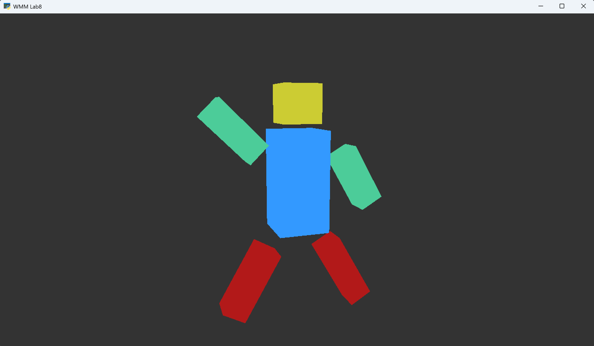
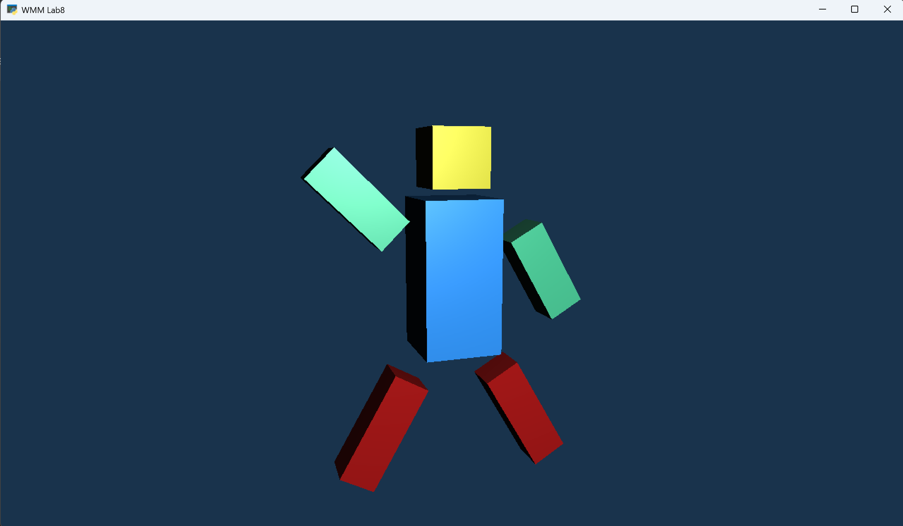
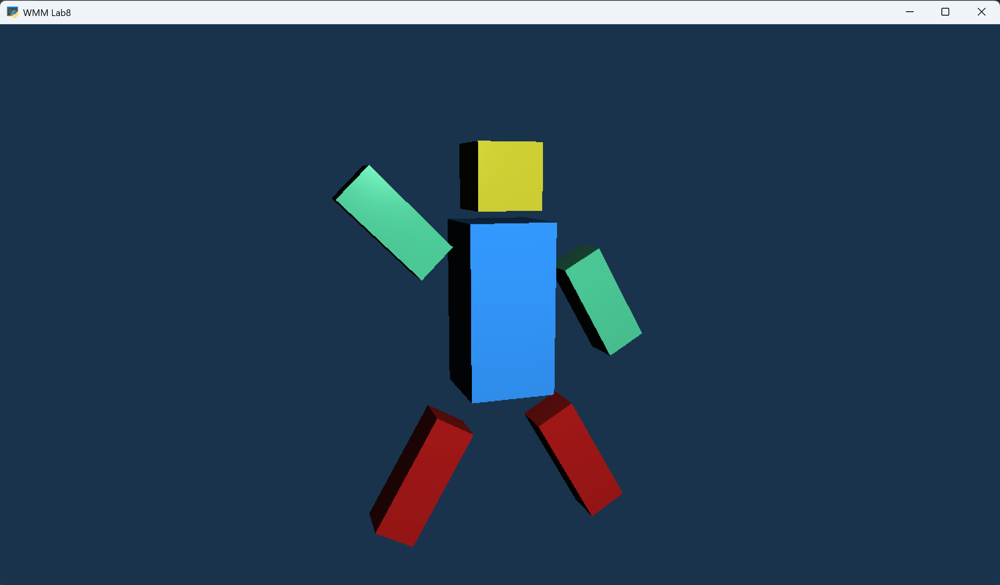
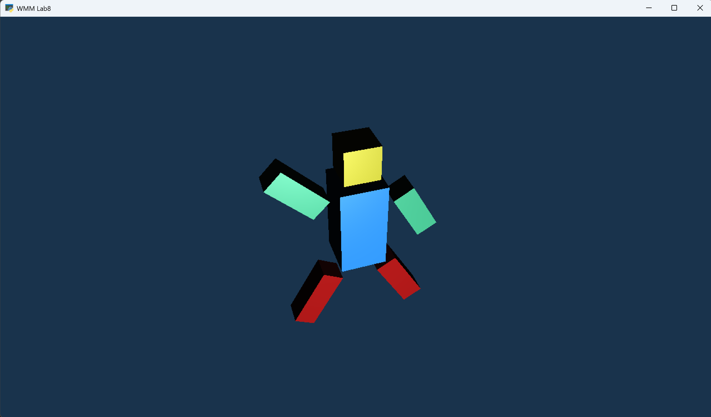
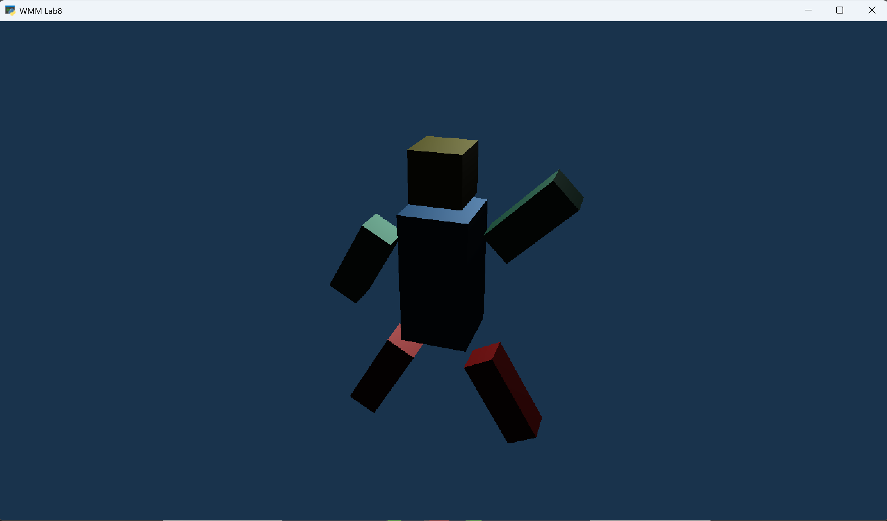
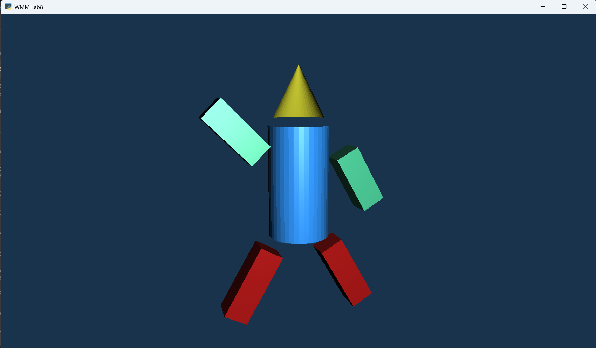

# Sprawozdanie

## Wstęp do multimediów (WMM) Laboratorium #8: Generowanie grafiki z wykorzystaniem popularnej biblioteki graficznej OpenGL

## Autor: Łukasz Szydlik 331446

## Wstęp

Celem laboratorium 8 jest zapoznanie się z biblioteką graficzną OpenGL oraz podstawami programowania na GPU. W tym celu do zrealizowania będą 3 ćwiczenia poruszające zagadnienia wyświetlania grafiki z jej użyciem. Treść ćwiczeń w pliku ”polecenia.pdf”.\
Dokumentacja OpenGL - https://registry.khronos.org/OpenGL/

## Zadanie 1

## Zadanie 2

Camera position = (5.0, 5.0, -15.0)\
Light position = (0.0, 7.0, -15.0)\
material_shininess = 10

Camera position = (5.0, 5.0, -15.0)\
Light position = (0.0, 7.0, -15.0)\
material_shininess = 80

Camera position = (5.0, 15.0, -15.0)\
Light position = (0.0, 7.0, -15.0)\
material_shininess = 10

Camera position = (5.0, 10.0, 15.0)\
Light position = (0.0, 10.0, -15.0)\
material_shininess = 10

## Zadanie 3

